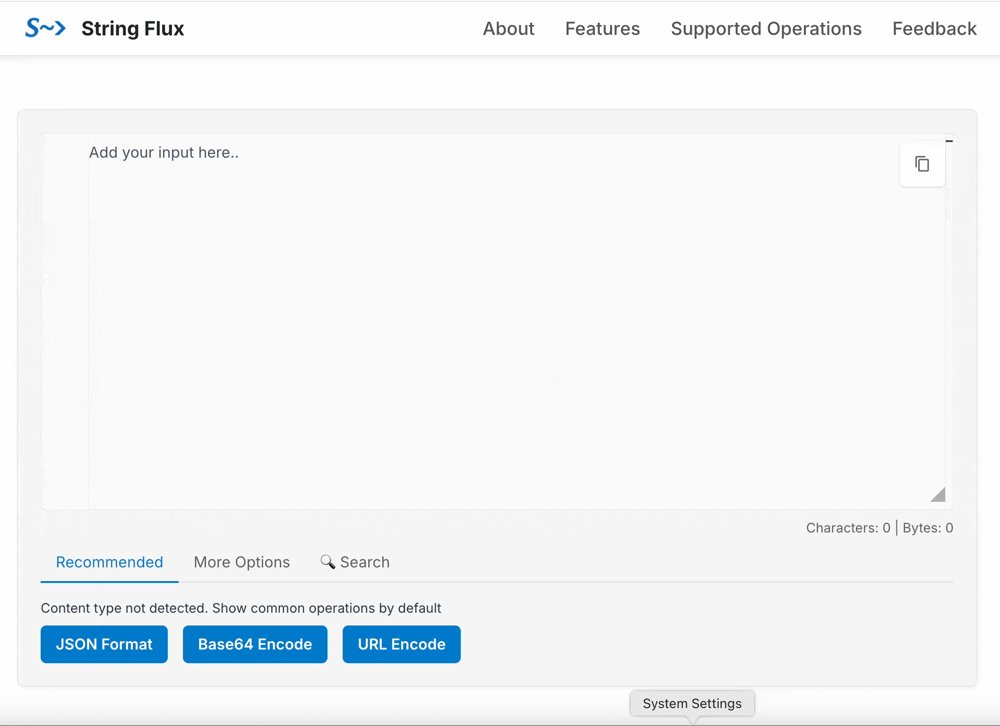

# String Flux — Simplify String Transformations for Developers (JSON format, Base64, YAML, XML and more)

Welcome to the issue tracker repository for [**String Flux**](https://stringflux.io), a tool built to make string transformations easier and faster for developers.

## What is String Flux?

String Flux is a powerful, web-based tool that helps you transform strings — like Base64 encode / decode, JSON format / minify, JSON to YAML, and more — without the pain of switching between multiple online tools.

Whether you’re decoding a minified Base64-encoded JSON string or trying to unescape a stack trace from a log file, String Flux makes it seamless.

## Why String Flux?

This tool was born out of frustration — bouncing between multiple tabs and tools just to decode or reformat strings while debugging or analyzing logs. String Flux centralizes that workflow and gives you a smooth, customizable, and extensible experience.

Even for one step transforms like JSON format, Base64 encoding, String Flux also helps to avoid user to search and choose online tools. String Flux can be the one place for all common string transforms for developers.

### Key Features

- **Smart detection** of input type — get transformation suggestions instantly  
- **Transform pipeline**: Chain multiple transformations together and view results at each step  
- **Supports multiple formats** like Base64 encode / decode, JSON format, URL encode / decode, JSON to YAML / XML / CSV, and more  
- **Fast and private** — everything happens in your browser

Try it now: [https://stringflux.io](https://stringflux.io)

##  Demo

Here’s a [quick demo](https://stringflux.io/?s=qzUAxXvv) of decoding Base64 and formatting JSON in seconds.

## Found a Bug? Got Feedback?

Please feel free to open an [issue](https://github.com/stringflux/stringflux/issues) in this repo. We're especially looking for feedback on:

- UX improvements
- Bugs or quirks
- New transform ideas or missing formats
- Performance or edge-case issues

Your insights help us make the tool better for everyone!
